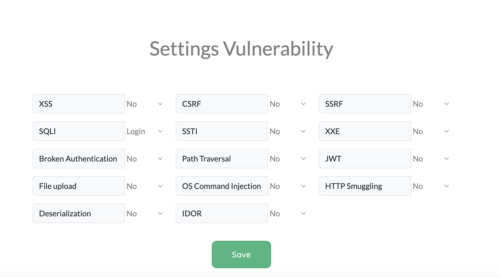
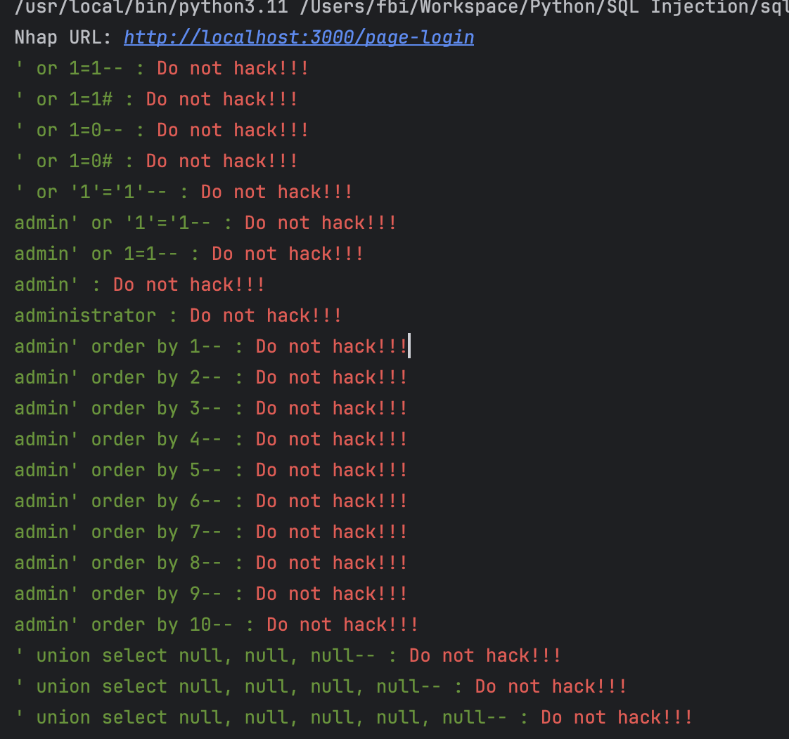
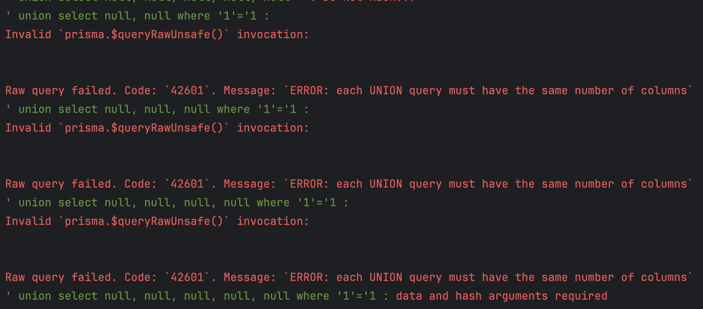
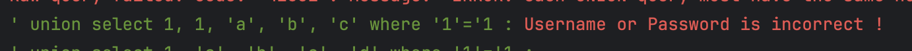
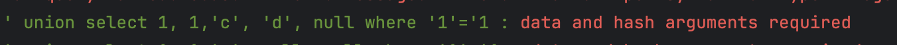
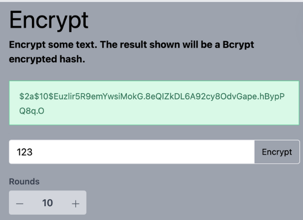
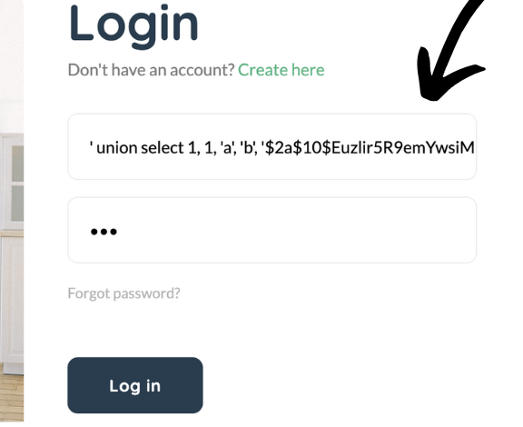
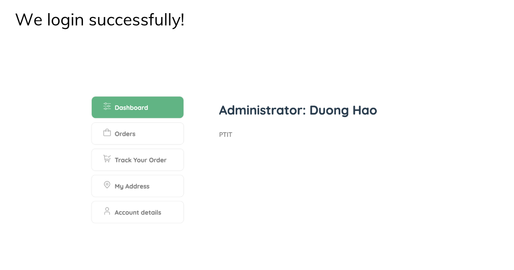
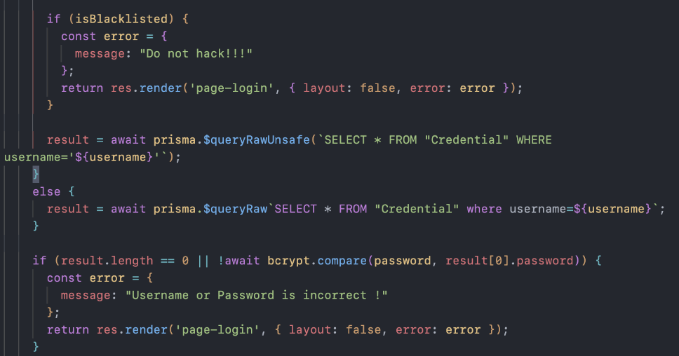

## Preparation

Go to `/settings` and set SQLI is `Login`

## Detect

We use tool to detect SQL Injection in Login

After we enter URL to attack SQL Injection, there are some results:

Error `Do not hack!!!` -> `or` and `--` are in blacklists of server.

Scroll to buttom

Server is using prisma.$queryRawUnsafe().

Let's see `' union select null, null, null, null, null where '1' = '1`: `data and hash arguments required`

=> Server query 5 columns.

Next step, we will find type of column and where column is password

=> Type of column 1,2 is number. 3,4,5 is string

`data and hash is required` -> column 5 is password

## Exploit

Hash can be using bcrypt, we will try

And login!

Explain: Server get our inject account, and ‘$2a....O’ is hash password of ‘123’ by using bcrypt with 10 rounds. So server hash ‘123’ and compare with our password we inject.

Src code

